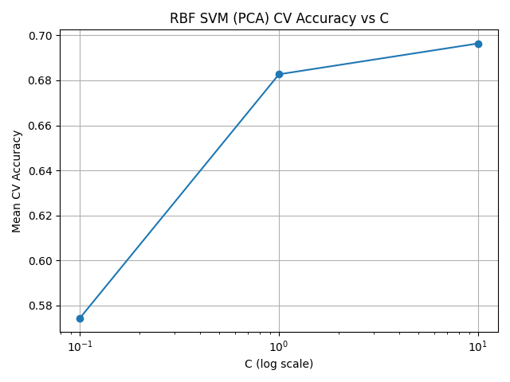
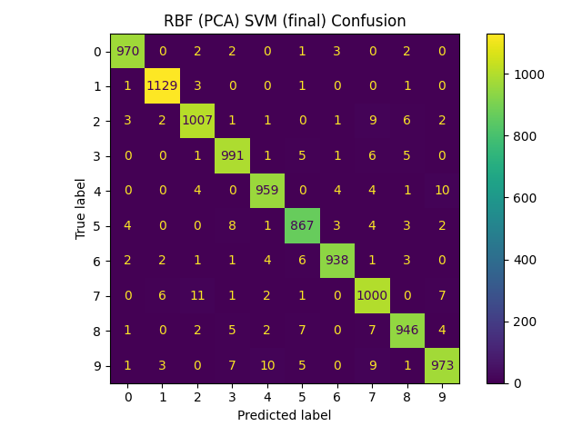
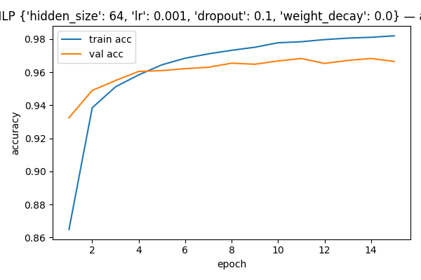
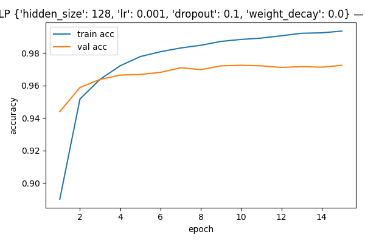
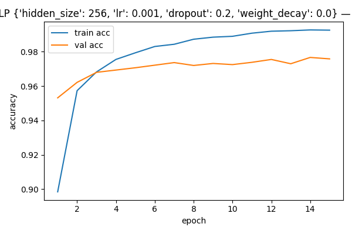
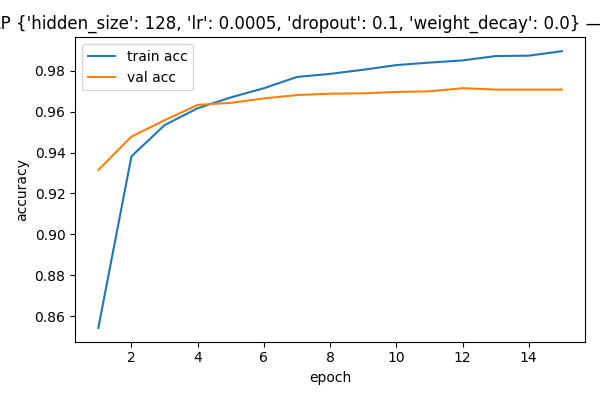
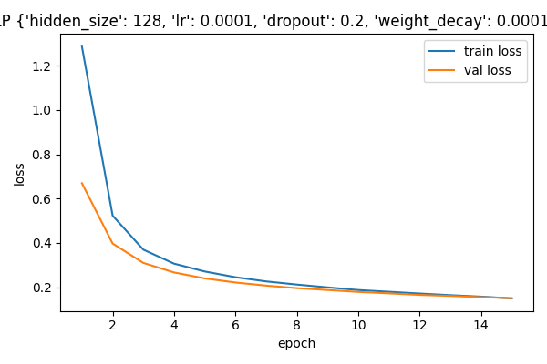
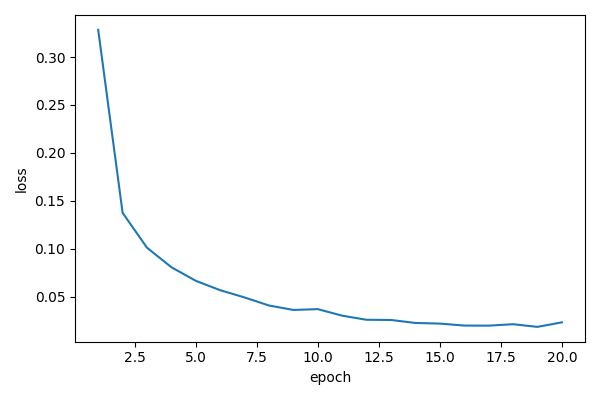
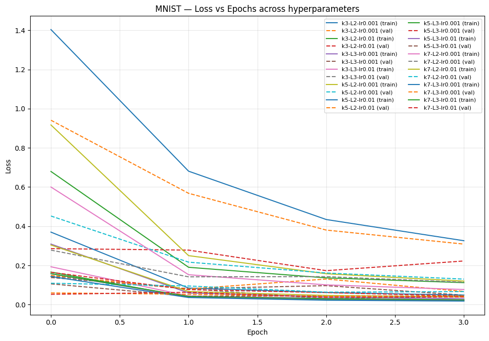
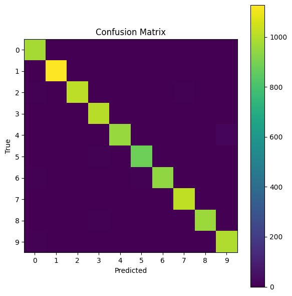

# Pattern-Recognition 
## Group exercises 
##### Group members : Alec Imhof, Fabia Schreyer, Loan Strübi, Ebrima Tunkara, Aurélie Wasem

### Support Vector Machine (SVM)

We evaluate two SVM variants on MNIST: a **linear** SVM (tuned quickly with `SGDClassifier`, then refit with `LinearSVC`) and an **RBF** SVM trained **after PCA (100 comps)**. Hyperparameters are tuned on a 10k stratified subset via cross-validation; the selected configs are then refit on the full training set and evaluated on the test set (confusion matrices below).  
*(Per the assignment, we report CV accuracy curves and the final confusion matrices; see the CSV files for full grids.)*

#### 1) Linear SVM (SGD → LinearSVC)
**Hyperparameter grid (train/val, 10k subset)**  
1) `{'alpha': 1e-5}`  
2) `{'alpha': 5e-5}`  
3) `{'alpha': 1e-4}`  
4) `{'alpha': 5e-4}`  

**Grid summary:** see `Results - SVM/cv_results_sgd.csv` (one row per alpha; sort by `mean_test_score`).  

**Best hyperparameters (subset CV):** `{'alpha': 5e-4}` → refit with `LinearSVC` on the full train set.  
**Model file:** `Results - SVM/svm_linear_final_full.joblib` (scaler: `Results - SVM/scaler.joblib`).  

**Test evaluation (final model)**  

---

#### 2) RBF SVM (with PCA = 100)
For the non-linear SVM, we apply PCA (100 components) before the RBF kernel.

**Hyperparameter grid (train/val on PCA-subset, 10k)**  
1) `{'C': 0.1, 'gamma': 'scale'}`  
2) `{'C': 0.1, 'gamma': 0.01}`  
3) `{'C': 0.1, 'gamma': 0.1}`  
4) `{'C': 1.0, 'gamma': 'scale'}`  
5) `{'C': 1.0, 'gamma': 0.01}`  
6) `{'C': 1.0, 'gamma': 0.1}`  
7) `{'C': 10.0, 'gamma': 'scale'}`  
8) `{'C': 10.0, 'gamma': 0.01}`  
9) `{'C': 10.0, 'gamma': 0.1}`  

  

**Grid summary:** see `Results - SVM/cv_results_rbf.csv` (full grid with mean CV accuracy).  

**Best hyperparameters (subset CV):** `{'C': 10.0, 'gamma': 'scale'}` (with PCA=100).  
**Model files:** `Results - SVM/pca_full.joblib`, `Results - SVM/svm_rbf_final_full.joblib`.  

**Test evaluation (final model)**  

**Notes.**  
- Linear SVM improves as `alpha` increases within the tested range (weaker regularization).  
- For RBF, `gamma='scale'` clearly dominates fixed `gamma` values; higher `C` helps within the explored grid.  

### Multilayer Perceptron (MLP)
#### Hyperparameter grid (train/val)
1) `{'hidden_size': 64,  'lr': 1e-3,  'dropout': 0.10, 'weight_decay': 0.0}`  
     
   

2) `{'hidden_size': 128, 'lr': 1e-3,  'dropout': 0.10, 'weight_decay': 0.0}`  
     
   

3) `{'hidden_size': 256, 'lr': 1e-3,  'dropout': 0.20, 'weight_decay': 0.0}`  
     
   

4) `{'hidden_size': 128, 'lr': 5e-4,  'dropout': 0.10, 'weight_decay': 0.0}`  
     
   

5) `{'hidden_size': 128, 'lr': 1e-4,  'dropout': 0.20, 'weight_decay': 1e-4}`  
     
   

**Grid summary:** see `results-MLP/grid_results.csv` (one row per combo; sort by `val_acc`).
| # | hidden_size | lr     | dropout | weight_decay | val_acc |
|---|-------------|--------|---------|--------------|--------:|
| 1 | 64          | 1e-3   | 0.10    | 0.0          | 0.9683  |
| 2 | 128         | 1e-3   | 0.10    | 0.0          | 0.9725  |
| 3 | 256         | 1e-3   | 0.20    | 0.0          | 0.9767  |
| 4 | 128         | 5e-4   | 0.10    | 0.0          | 0.9715  |
| 5 | 128         | 1e-4   | 0.20    | 1e-4         | 0.9547  |

**Best hyperparameters:** stored in `results-MLP/best_hparams.json` (weights at best val epoch: `results-MLP/best_on_val_mlp.pth`).

 `{'hidden_size': 256, 'lr': 1e-3,  'dropout': 0.20, 'weight_decay': 0.0}`

### Final training (train + val with best hyperparameters)
Training history: `results-MLP/final_train_history.csv`

No validation curves here, everything is used for training.

  

### Test performance
The final model weights (this is the model used to evaluate the test set) `results-MLP/final_mlp_trainval.pth`

Performance on the testing set:

**Accuracy: 0.9770.**

### CNN — Aggregate curves across hyperparameters

Below we show **train vs. validation** curves aggregated for all CNN hyperparameter settings.

**Legend format:** `k{3|5|7}-L{2|3}-lr{0.001|0.01}` where  
`k` = kernel size, `L` = number of conv blocks, `lr` = learning rate.

Solid = train, dashed = validation.

#### What we observe
- **Fast convergence:** most configs reach >95–99% validation accuracy within **1–3 epochs**.
- **Learning rate matters:** `lr = 0.001` consistently yields **lower val loss & higher val acc**; `lr = 0.01` underperforms (higher val loss, flatter/slower acc).
- **Kernel size:** `k=3` and `k=5` are the most stable; `k=7` brings no clear gain and can slow/imprecise early updates.

**Best validation configuration**  
| kernel | conv blocks | lr   | best val acc |
|-------:|------------:|:-----|-------------:|
| 3×3    | 3           | 0.01 | **0.9914**

**Re-train & test.** Re-trained the best config for 5 epochs on the train split (with validation monitoring).  

Best validation epoch by loss: **epoch 2** (val loss ↓ to 0.0392, val acc 0.9877), then mild overfitting.  

**Test accuracy:** **0.9874**.

**Notes.**

- Almost all mass is on the diagonal; a few rare off-diagonal errors remain.

 
